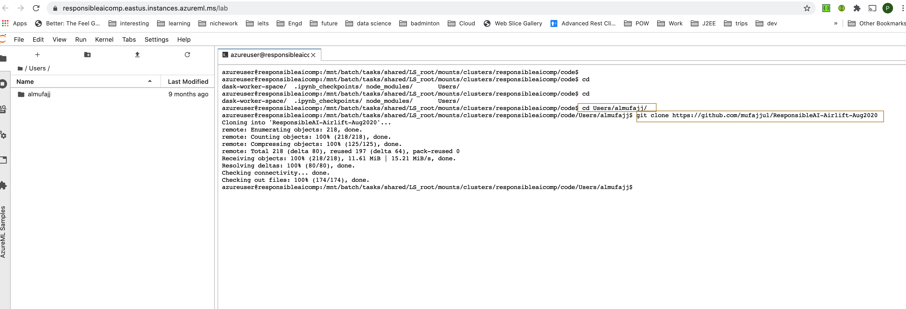

# Clone git repo in your AML Compute Cluster

Please follow the following steps to clone the Responsible AI Github Repo to your environment.

## Step 1: Open Jupyter Lab 

Click on compute Icon on the left pane (this will open three tabs, the first tab is "compute instance"), under application URI, click on Jupyter lab.  

This will launch Jupyter Lab Workspace 

## Step 2: Launch Terminal

Click on the "Terminal" icon under other on the launcher tab. 

This will open up the terminal 

## Step 3: Clone Repo

Type the followings on the terminal:

cd User/your alias 

git clone https://github.com/mufajjul/ResponsibleAI-Airlift-Aug2020

This will clone the repo in your home directory.  

-----
----

If you are new to Azure Machine Learning, see:

- [Azure Machine Learning service](https://azure.microsoft.com/services/machine-learning-service/)
- [Azure Machine Learning documentation](https://docs.microsoft.com/azure/machine-learning/)
- [Azure Machine Learning template reference](https://docs.microsoft.com/azure/templates/microsoft.machinelearningservices/allversions)
- [Quickstart templates](https://azure.microsoft.com/resources/templates/)

If you are new to template development, see:

- [Azure Resource Manager documentation](https://docs.microsoft.com/azure/azure-resource-manager/)
- [Create an Azure Machine Learning service workspace by using a template](https://docs.microsoft.com/azure/machine-learning/service/how-to-create-workspace-template)

Tags: Azure Machine Learning, Machine Learning, Secrets, Resource Manager, Resource Manager templates, ARM templates

